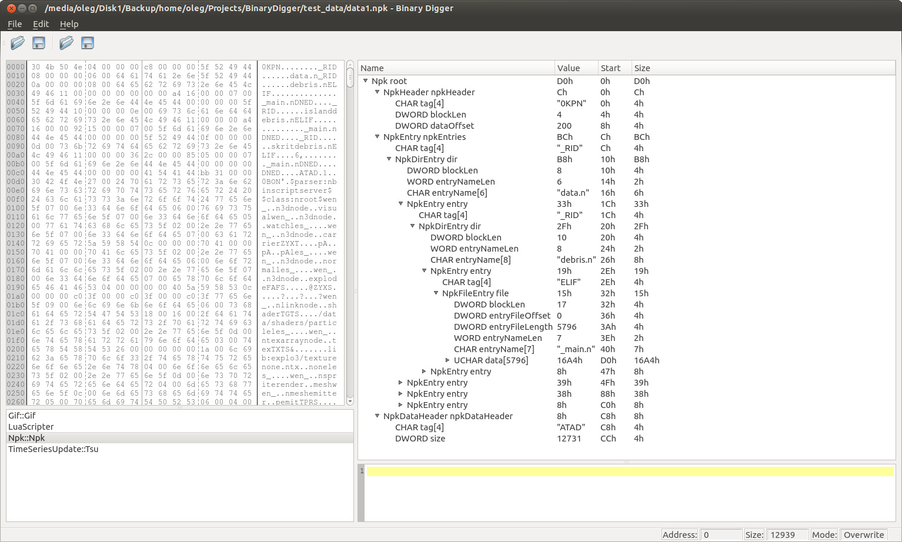
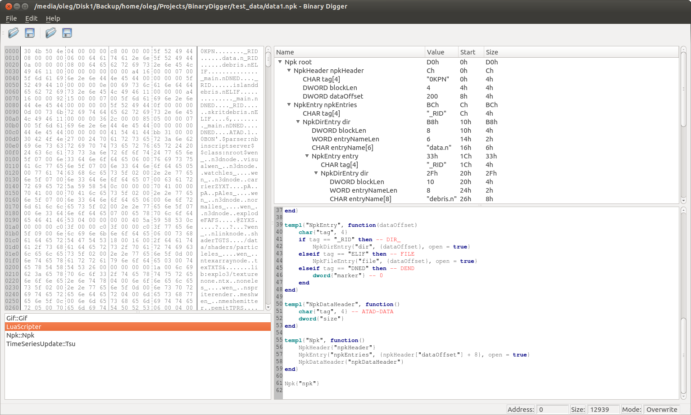

# Binary Digger

## Introduction

The idea of **BinaryDiger** (BD) is to help programmers inspecting unknown data formats and traversing quickly known ones.

BD uses plugin system for digging different data formats.
There are 2 different types of plugins: compiled and script based. Compiled plugin is a dynamic library that provides
specific interface for the main application to access hierarchical data.
Scripter (script based plugin) is also dynamic library which loads external scripts to parse data.

## Screenshots

## Development tools.

- GUI: Qt.
- Plugins: plain C interface. C macroses to emulate 010 Editor templates.
- Scripting: Lua. Script has only read access to the hierarchy tree.
- Build system: CMake.

## Versions features.

### Version 0.1.0

- HEX view and synchronization with tree navigation (http://qt-apps.org/content/show.php/?content=133189)
- GUI with tree view
- defining templates as C macroses
- support of the minimum template types: char, short, int, int64, array, templ
- minimal Lua scripting support (console only)

### Version 0.1.1

- minimal Lua scripting support (Gui)
- configurable script syntax highlighting

### Version 0.X.0

- large files support (using memory mapped files or other techniques)
- multiple templates support: apply different templates to the hierarchy elements data (blobs)

## TODO

* Full Lua scripting support.
* Array as tree node. DONE
* *"size"* property of the node to specify predefined hardcoded node size. For the POD types generate "size" automatically.
* Postponed nodes loading/generation using "size" property. Additional parameter to specify deepness of tree generation.
* Node properties (size, color, toString, endian, ...).
